# 🧠 Executive Summary: AI Builder LMS (AB-LMS) Integration

> **Tagline**: *Learn → Build → Ship AI Products*  
> **GitHub Repository**: [https://github.com/1997agarwal/Learning-Management](https://github.com/1997agarwal/Learning-Management)  
> **Merged Target**: Integrated directly into **StartupOS** (`1997agarwal/StartupOS`)

---

## 🎯 1. Core Vision & Concept

The **AI Builder LMS (AB-LMS)** empowers non-coders, product managers, and early founders to build real-world software products using AI coding tools (**Antigravity**, **Claude Code**, **Cursor**, **Replit**, **Emergent**).

Unlike passive video platforms (Udemy, Coursera), AB-LMS drives an **active output flywheel**:
1. **Learn**: Follow standardized PRD-backed course structures.
2. **Build**: Copy tool-abstracted prompts into AI coding environments with real-time AI Tutor assistance.
3. **Ship**: Deploy apps, push repositories to GitHub, and submit live project links.
4. **Evaluate & Showcase**: Receive automated **AI Evaluator Reports** and human PM examiner feedback, followed by promotion in the public showcase.

---

## 🏛️ 2. Architecture: 3 Core Portals

```mermaid
graph TD
    A[AB-LMS Engine] --> B[System 1: Learner LMS Portal]
    A --> C[System 2: Course Creator & Examiner Studio]
    A --> D[System 3: Admin Console & Ecosystem Engine]

    subgraph System 1: Learner LMS Portal
        B --> B1[Learner Onboarding & Market-Leading LMS Catalog]
        B --> B2[Standardized 8-Part Course Architecture]
        B --> B3[Tool Abstraction Workbench: Antigravity, Claude Code, Cursor, Replit]
        B --> B4[Context-Aware Floating AI Tutor Layer]
        B --> B5[Project Submission Form & Status Dashboard]
    end

    subgraph System 2: Course Creator & Examiner Studio
        C --> C1[Course Authoring Suite - PRD 8-Part Template]
        C --> C2[Examiner Evaluation Workspace]
        C --> C3[Automated AI Evaluator Report Integration]
        C --> C4[Human PM Feedback & Endorsement Publisher]
    end

    subgraph System 3: Admin Console & Ecosystem Engine
        D --> D1[Executive KPI Dashboard]
        D --> D2[Registered Course Creators Directory]
        D --> D3[Live Standardized Courses Registry]
        D --> D4[Learner Activity & Shipped Products Audit Table]
        D --> D5[Clickable GitHub Repositories & Live Demo Links]
    end
```



---

## 🧩 3. Key Features Breakdown across the 3 Systems

### System 1: Learner LMS Portal
* **Market-Leading LMS Catalog**: Clean course discovery UI with difficulty tags, estimated completion time, and tools supported.
* **Standardized 8-Part Course Structure**:
  1. *Problem Definition*
  2. *Target Use Case*
  3. *PRD Breakdown*
  4. *AI Workflow Architecture*
  5. *Tool Abstraction Layer*
  6. *Build Steps & Copyable Prompts*
  7. *Expected Output Verification*
  8. *Step Execution Checkpoint*
* **Tool Abstraction Layer**: Zero tool lock-in. Switch copyable prompt blocks between **Antigravity**, **Claude Code**, **Cursor**, **Replit**, and **Emergent**.
* **Context-Aware AI Tutor Layer**: Floating assistant providing non-coder analogies and prompt debugging.
* **Project Submission & Dashboard**: Form to submit GitHub repository link, live demo URL, problem solved, and tools used tags.

### System 2: Course Creator & Examiner Studio
* **Course Authoring Workbench**: Create & articulate standardized courses following the 8-part PRD template.
* **Examiner Evaluation Workspace**:
  - Inspect student project submissions.
  - View automated **AI Evaluator Engine Reports** (score, code architecture quality, UX suggestions).
  - Write human PM feedback comments, assign final scores (1-100), and publish official endorsements.

### System 3: Admin Console & Ecosystem Engine
* **Executive Metrics Bar**:
  - Total Signed Up Course Creators
  - Total Live Courses
  - Total Signed Up Learners
  - Total Completed Courses
  - Total AI Products Built & Shipped
* **Course Creators Directory**: List of signed up creators, joined date, live courses count, and student satisfaction ratings.
* **Live Courses Registry**: Audit, publish, or archive courses.
* **Learners Activity & Shipped Products Audit Table**:
  - Learner Name, Email, & Signed Up Date
  - Daily Streak & Total XP
  - Enrolled & Completed Courses Count
  - Total Shipped Products Count
  - **Clickable GitHub Repository Links & Live Demo Links**
  - Review & Evaluation Status

---

## 🛢️ 4. Data Schemas & Models

```sql
-- Users Table
CREATE TABLE users (
  id UUID PRIMARY KEY DEFAULT gen_random_uuid(),
  email VARCHAR(255) UNIQUE NOT NULL,
  name VARCHAR(255) NOT NULL,
  role VARCHAR(50) CHECK (role IN ('LEARNER', 'CREATOR', 'ADMIN')),
  xp INT DEFAULT 0,
  streak_days INT DEFAULT 0,
  created_at TIMESTAMP DEFAULT CURRENT_TIMESTAMP
);

-- Courses Table
CREATE TABLE courses (
  id UUID PRIMARY KEY DEFAULT gen_random_uuid(),
  creator_id UUID REFERENCES users(id),
  title VARCHAR(255) NOT NULL,
  category VARCHAR(100),
  level VARCHAR(50),
  structure JSONB NOT NULL, -- Standardized 8-part PRD JSON
  status VARCHAR(50) DEFAULT 'LIVE'
);

-- Submissions Table
CREATE TABLE project_submissions (
  id UUID PRIMARY KEY DEFAULT gen_random_uuid(),
  user_id UUID REFERENCES users(id),
  course_id UUID REFERENCES courses(id),
  project_title VARCHAR(255) NOT NULL,
  problem_solved TEXT NOT NULL,
  github_url TEXT NOT NULL,
  live_demo_url TEXT,
  tools_used JSONB NOT NULL,
  status VARCHAR(50) DEFAULT 'AI_EVALUATED',
  ai_evaluation JSONB,
  created_at TIMESTAMP DEFAULT CURRENT_TIMESTAMP
);

-- Reviews Table
CREATE TABLE reviews (
  id UUID PRIMARY KEY DEFAULT gen_random_uuid(),
  submission_id UUID REFERENCES project_submissions(id),
  reviewer_id UUID REFERENCES users(id),
  feedback_text TEXT NOT NULL,
  score INT CHECK (score BETWEEN 1 AND 100),
  created_at TIMESTAMP DEFAULT CURRENT_TIMESTAMP
);
```

---

## 🎨 5. Design System Specification
- **UI Aesthetics**: Clean slate (`#f8fafc` / `#020617`) layout featuring refined card elevations, crisp typography, and high-contrast semantic badges (`#10b981` emerald, `#6366f1` indigo, `#f59e0b` amber).
